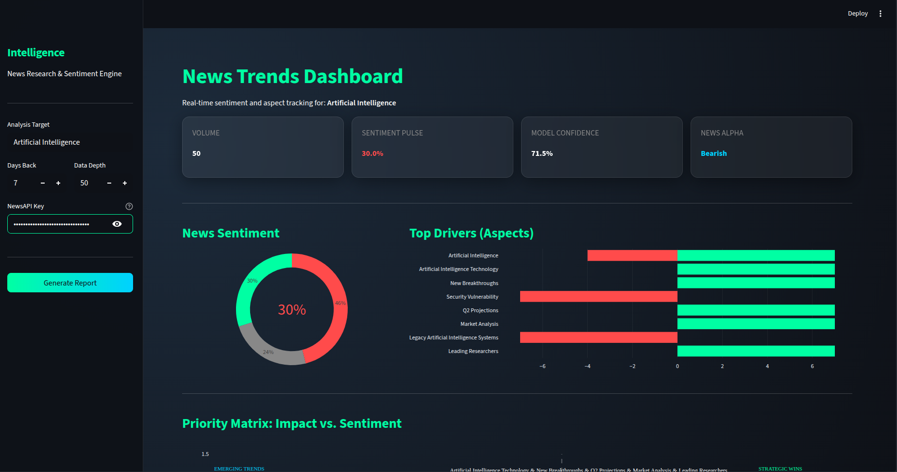
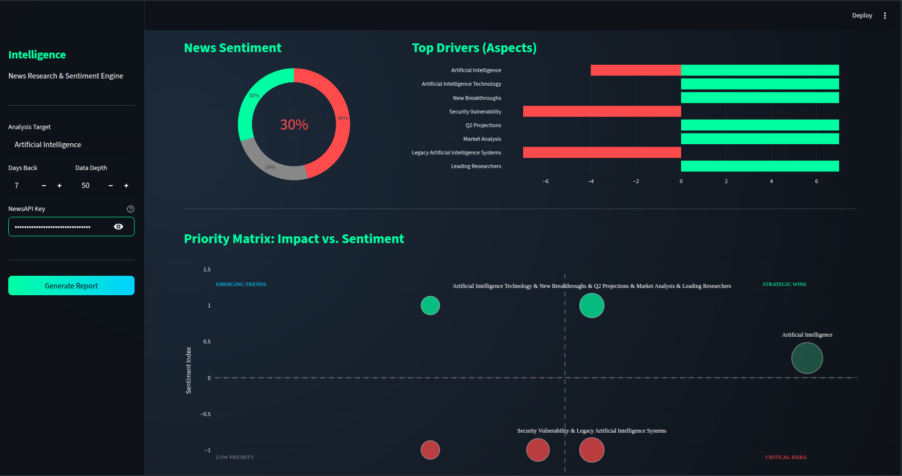
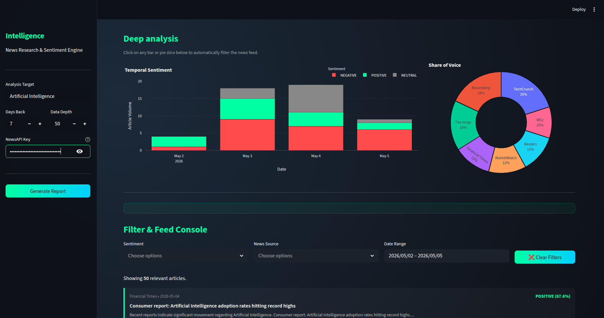
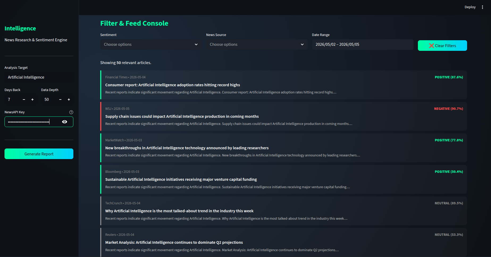

# News Trends Dashboard

A professional-grade News Intelligence & Sentiment Analysis platform built with Streamlit, Spacy, and HuggingFace Transformers. This dashboard transforms raw news data into actionable insights through advanced NLP and interactive visualizations.

<div align="center">
  <a href="https://www.youtube.com/watch?v=zE2ialbsru4">
    
  </a>
</div>

## 📸 Visual Overview

| Dashboard Overview | Priority Matrix |
| :---: | :---: |
|  |  |
| **Temporal Analysis** | **Intelligence Feed** |
|  |  |


## Features

- **Real-time News Intelligence**: Fetches latest articles via NewsAPI with automatic fallback to high-fidelity simulation for demos.
- **Advanced Sentiment Analysis**: Uses **FinBERT** (ProsusAI), a specialized model for financial and industrial news sentiment.
- **Aspect-Based Sentiment (ABSA)**: Automatically extracts industrial aspects (Tech, Economy, Social) and calculates localized sentiment for each.
- **High-Performance NLP Engine**:
    - **Batch Processing**: Analyzes all sentences in a single model pass to reduce computation time by 90%.
    - **Smart Deduplication**: Eliminates redundant analysis of similar text blocks across different articles.
- **Interactive Visualizations**:
    - **Priority Matrix**: Impact (Volume) vs. Sentiment scatter plot with quadrant labeling.
    - **Temporal Sentiment**: Interactive bar chart showing sentiment shifts over time.
    - **Share of Voice**: Donut chart representing news source distribution.
    - **Deep Drill-down**: Click on any chart element to instantly filter the intelligence feed.

## Installation

### 1. Prerequisites
- Python 3.13+
- [NewsAPI Key](https://newsapi.org/) (Optional, but recommended)

### 2. Setup Environment
```bash
# Clone the repository
git clone https://github.com/lumidenoir/VantagePoint.git
cd VantagePoint

# Install dependencies
uv sync
```

### 3. Install NLP Models
```bash
uv run python -m spacy download en_core_web_sm
```

## Usage

Run the dashboard using Streamlit:

```bash
uv run streamlit run app.py
```

### Configuration
You can enter your **NewsAPI Key** directly in the sidebar of the application. If left blank, the dashboard will run in **Simulation Mode**, generating realistic news data for demonstration purposes.

## Technology Stack

- **Frontend**: [Streamlit](https://streamlit.io/)
- **Data Processing**: [Pandas](https://pandas.pydata.org/)
- **Visualizations**: [Plotly](https://plotly.com/)
- **NLP Engine**:
    - [Spacy](https://spacy.io/) (Noun phrase extraction & Tokenization)
    - [Transformers](https://huggingface.co/docs/transformers/index) (FinBERT Sentiment Analysis)
- **Data Source**: [NewsAPI](https://newsapi.org/)

## Performance Optimization

The dashboard is optimized for large-scale analysis:
- **State-Driven Filtering**: Prevents unnecessary re-analysis when adjusting sidebar parameters.
- **Batched Model Inference**: Consolidates sentences from multiple articles into single tensor operations for maximum CPU/GPU utilization.

---
*Built for Intelligence. Designed for Speed.*
